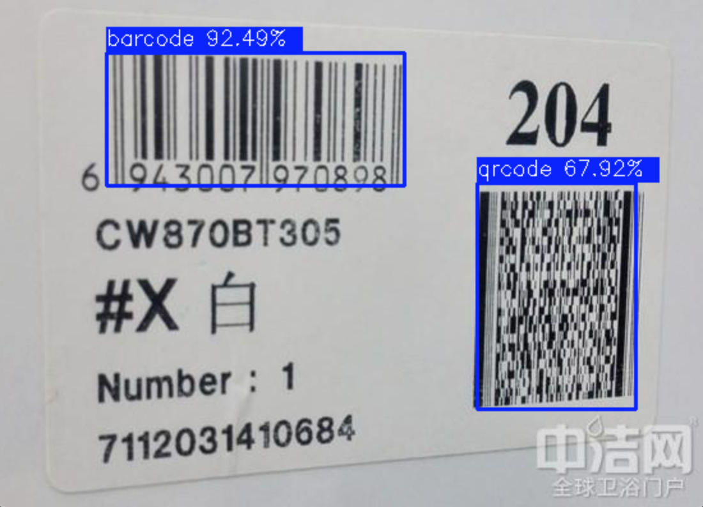
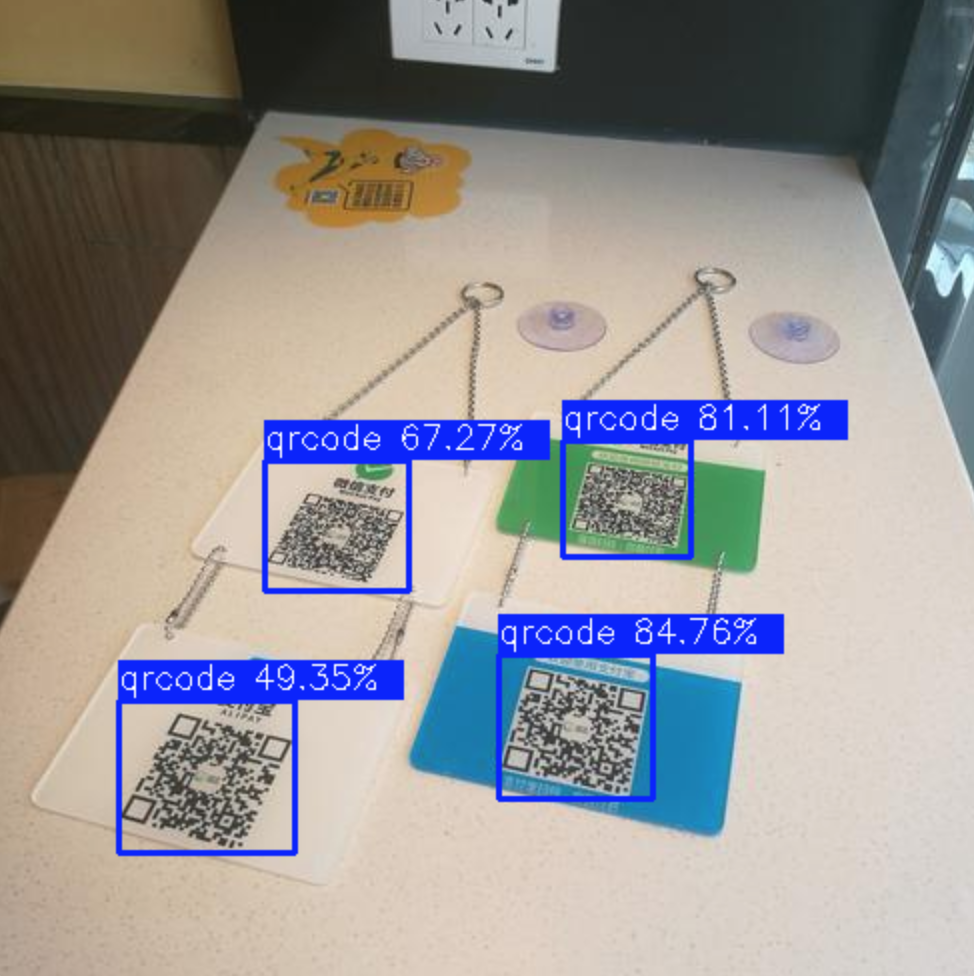

# Light QR Code And Barcode Detector

### Introduce

The light code detector, like the WeChat and Alipay scan code, can scan more bar codes or QR codes in a single image. The model is trained based on the NanoDet-M structure, which currently supports bar codes and QR codes, and the ONNX model is 3.7M. Provide C++ implementation based on OpenCV dnn inference.

### Requirements

- OpenCV

### TODO

- [x] OpenCV dnn inference
- [ ] MNN inference
- [ ] Python Native Interface
- [ ] Integrated zxing

### How to run

```bash
mkdir build
cd build
cmake ..
make
./test_images ../models/codev2.onnx ../test_images/code-1.jpg ../test_images/code-2.jpg ../test_images/code-3.jpg
```

### demo


